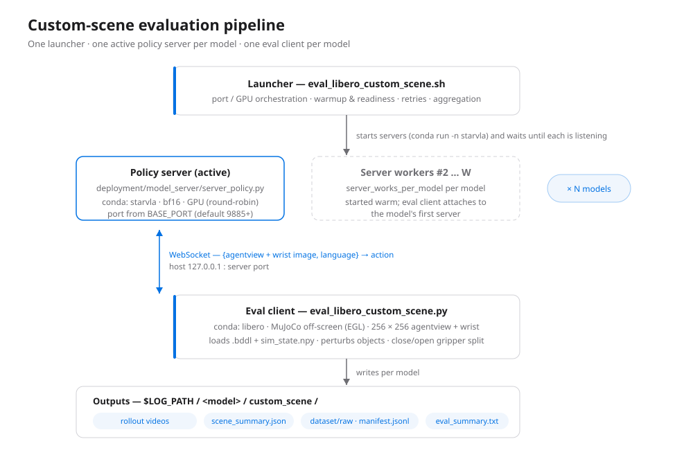
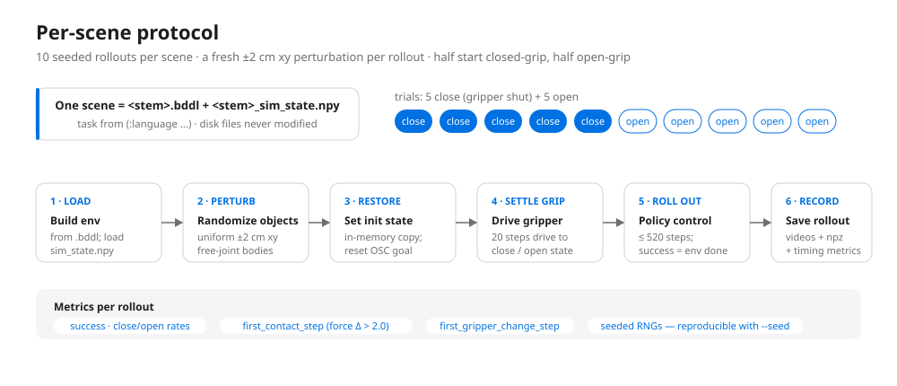

# Custom-Scene Robustness Benchmark (starVLA × LIBERO)

Evaluation pipeline for benchmarking vision-language-action (VLA) policies on **your own
LIBERO scenes** under a controlled robustness protocol: every rollout gets a fresh small
random perturbation of object positions, and half of the rollouts start with the robot
gripper **closed** instead of the default open — probing how well a policy recovers from
initial states it never saw in training.

The whole benchmark is driven by a single launcher script:

```bash
$STARVLA/examples/LIBERO/eval_files/eval_libero_custom_scene.sh
```

> **Path convention.** `$STARVLA` below denotes the starVLA repo root on *your* machine,
> e.g. `export STARVLA=~/starVLA` after cloning. The launcher ships with the author's
> paths filled in — every absolute path you need to change lives in one
> "User-configurable parameters" block at the top of the script (see
> [§6 Configure the launcher](#6-configure-the-launcher)).

The launcher starts one policy server per model on GPU, runs the eval client
(`eval_libero_custom_scene.py`) headlessly in MuJoCo, and finally aggregates results.

<p align="center">
  
</p>

---

## Table of contents

1. [Benchmark protocol](#1-benchmark-protocol)
2. [Datasets & assets (download)](#2-datasets--assets-download)
3. [Repository layout](#3-repository-layout)
4. [Environment setup](#4-environment-setup)
5. [Preparing your scenes](#5-preparing-your-scenes)
6. [Configure the launcher](#6-configure-the-launcher)
7. [Registering models](#7-registering-models)
8. [Usage](#8-usage)
9. [Outputs & metrics](#9-outputs--metrics)
10. [How the launcher works](#10-how-the-launcher-works)
11. [Troubleshooting](#11-troubleshooting)

---

## 1. Benchmark protocol

Each **scene** is a pair of files — a task definition `<stem>.bddl` plus a recorded
initial physics state `<stem>_sim_state.npy`. For every scene the client runs
`num_close_trials + num_open_trials` rollouts (default **5 + 5 = 10**):

<p align="center">
  
</p>

| Stage | What happens | Default |
|---|---|---|
| Load | Env is built from the `.bddl`; the recorded state is loaded into an **in-memory copy** (on-disk files are never modified) | — |
| Perturb | A fresh uniform **xy offset** is applied to every *free-joint* object (hinge/slide joints such as drawers or stove buttons are never touched) | `obj_noise_xy = 0.02` (±2 cm) |
| Restore | The perturbed state is set as the init state; the OSC controller goal is re-anchored to the current EEF pose so the arm does not drift on step 1 | — |
| Settle gripper | The gripper is *driven* (not teleported) to the target opening by stepping a zero-delta arm action | `gripper_settle_steps = 20` |
| Roll out | The policy controls the robot for at most **520 steps**; a rollout is a success iff the env's `done` signal fires | `num_steps_wait = 0` |
| Record | Agentview + wrist videos, an `.npz` episode, and timing metrics are written | always |

Design notes:

- **Closed-grip starts.** The `close` trials begin with the gripper fully closed — an
  out-of-distribution initial state for most LIBERO-trained policies. Success rates are
  reported separately for `close` and `open` splits, plus overall.
- **Seeded reproducibility.** Scene sampling (`--num_scenes`), object perturbations, and
  env placement retries all use dedicated seeded RNGs, so a run is reproducible from
  `--seed` alone.
- **Robust env construction.** LIBERO's randomized placement sampler can fail on the
  tight (~2 cm) regions of custom scenes; the client reseeds and retries up to 12 times
  (the layout is throwaway anyway — it is overwritten by the recorded sim state).

## 2. Datasets & assets (download)

Three companion datasets are hosted on ModelScope (org `ataier`). Install the CLI once,
then download what you need:

```bash
pip install -U modelscope
```

| Dataset | Contents | Put it at | Needed for eval? |
|---|---|---|---|
| [`ataier/LIBERO_Recovery_Assets`](https://www.modelscope.cn/datasets/ataier/LIBERO_Recovery_Assets) | **Scene files** — the `.bddl` + `_sim_state.npy` libraries used by this benchmark | `$STARVLA/assets/scenes/` | ✅ yes |
| [`ataier/LIBERO_Recovery_Expert`](https://www.modelscope.cn/datasets/ataier/LIBERO_Recovery_Expert) | **Expert demonstrations** (recovery / regrasp teaching data, LeRobot format) | `$STARVLA/datasets/` (any location — referenced by training configs) | ❌ training only |
| [`ataier/LIBERO_10_LL`](https://www.modelscope.cn/datasets/ataier/LIBERO_10_LL) | **Pre-failure history** — LIBERO-10 episodes truncated just before the failure point | `$STARVLA/datasets/` (any location — referenced by training configs) | ❌ training only |

```bash
# 1) Scene assets — required by the evaluation
modelscope download --dataset ataier/LIBERO_Recovery_Assets \
  --local_dir "$STARVLA/assets/scenes"

# 2) Expert demonstrations — for training recovery policies
modelscope download --dataset ataier/LIBERO_Recovery_Expert \
  --local_dir "$STARVLA/datasets/LIBERO_Recovery_Expert"

# 3) Pre-failure history (LIBERO-10) — for training recovery policies
modelscope download --dataset ataier/LIBERO_10_LL \
  --local_dir "$STARVLA/datasets/LIBERO_10_LL"
```

(`git clone https://www.modelscope.cn/datasets/ataier/<name>.git` works too.)

After step 1 you should see the scene libraries side by side:

```
$STARVLA/assets/scenes/
├── selected_bddl_scenes_spatial/   # 168 scenes — the launcher's default
├── selected_bddl_scenes_goal/      #  91 scenes
├── selected_bddl_scenes_object/    #  77 scenes
├── selected_bddl_scenes_10/        # 207 scenes
└── selected_bddl_scenes_90/        # 337 scenes
```

Only the scene assets are required to *run the benchmark*; the two training datasets are
what the recovery policies demonstrated on the project page were trained on.

## 3. Repository layout

Paths relative to the starVLA repo root (`$STARVLA`).

| File | Role |
|---|---|
| `examples/LIBERO/eval_files/eval_libero_custom_scene.sh` | **Launcher** — everything you interact with. Starts servers, runs clients, aggregates. |
| `examples/LIBERO/eval_files/eval_libero_custom_scene.py` | Eval client — builds MuJoCo envs, applies the perturbation + gripper protocol, records results. |
| `examples/LIBERO/eval_files/model2libero_interface.py` | `ModelClient` — WebSocket client that talks to the policy server. |
| `examples/LIBERO/eval_files/install_libero.sh` | Installs the `libero` client env (MuJoCo, LIBERO editable install, …). |
| `deployment/model_server/server_policy.py` | Policy server (bf16, WebSocket) loaded inside the `starvla` env. |
| `assets/scenes/selected_bddl_scenes_*` | Scene libraries — restored from `LIBERO_Recovery_Assets` (§2). |
| `LIBERO/` | LIBERO checkout (`LIBERO_HOME`) used by the client env. |
| `LIBERO/eval_result/custom_scene/` | Default output root (`LOG_PATH`). |

## 4. Environment setup

### Prerequisites

- **NVIDIA GPU(s)** with a recent driver — the policy server runs in bf16 on CUDA, and
  the client renders MuJoCo **off-screen via EGL** (`MUJOCO_GL=egl`,
  `PYOPENGL_PLATFORM=egl` are set by the launcher). Headless machines need EGL/GLES
  libraries available (usually already installed with the NVIDIA driver).
- **conda** (miniconda or anaconda, any location).
- **Disk** — each rollout writes two ~520-frame MP4s plus an `.npz`; a full
  30-scene × 10-trial run produces ~300 episodes per model.

### The two conda envs

The launcher uses exactly two environments (both Python 3.10, torch 2.6.0+cu124):

| Env | Used by | What it needs |
|---|---|---|
| `starvla` | Policy server (`server_policy.py`) | starVLA + its `requirements.txt` (transformers 4.57, flash-attn, …) — see [§4.1](#41-server-env-starvla) |
| `libero` | Eval client (`eval_libero_custom_scene.py`) | MuJoCo 3.2.3, LIBERO (editable), tyro, websockets, imageio, numpy 1.24.4 — see [§4.2](#42-client-env-libero) |

#### 4.1 Server env (`starvla`)

Created once from the starVLA repo root:

```bash
cd "$STARVLA"
conda create -n starvla python=3.10 -y
conda activate starvla
pip install -r requirements.txt
pip install flash-attn --no-build-isolation
pip install -e .
```

The server loads checkpoints directly by path, so keep model weights anywhere on disk;
HuggingFace access is **forced offline** by the launcher (`HF_HUB_OFFLINE=1`, …) — make
sure any base-model artifacts are already in `~/.cache/huggingface`.

#### 4.2 Client env (`libero`)

Use the provided installer, which activates the env (create it first if it does not
exist yet), pins MuJoCo/numpy, clones LIBERO as an editable install, and verifies the
imports:

```bash
cd "$STARVLA"
conda create -n libero python=3.10 -y        # only if not already present
LIBERO_DIR="$STARVLA/LIBERO" bash examples/LIBERO/eval_files/install_libero.sh
```

`LIBERO_DIR` controls where the LIBERO checkout is cloned (default `$HOME/LIBERO`); the
launcher's `LIBERO_HOME` variable must point at the same checkout (§6).

### Quick sanity check

```bash
conda activate libero
python -c "from libero.libero.envs import OffScreenRenderEnv; print('client OK')"
conda activate starvla
python -c "import flash_attn, transformers; print('server OK')"
```

## 5. Preparing your scenes

Point `--scene_dir` at any folder of scene pairs. The client globs `*.bddl`
**recursively** and pairs each with its sibling `<stem>_sim_state.npy`; a missing `.npy`
skips that scene with a warning. Real layout inside `selected_bddl_scenes_spatial`:

```
selected_bddl_scenes_spatial/
└── pick_up_the_black_bowl_between_the_plate_and_the_ramekin_and_place_it_on_the_plate/
    ├── episode_000/
    │   ├── step_0180.bddl              # task definition (:language line = instruction)
    │   ├── step_0180_sim_state.npy     # flattened MuJoCo state saved at that step
    │   ├── step_0200.bddl
    │   └── step_0200_sim_state.npy
    ├── episode_003/
    └── ...
```

- The task instruction is parsed from the `(:language …)` line in the `.bddl`
  (see [`docs/example_bddl.snippet`](docs/example_bddl.snippet)).
- If the directory holds more scenes than `--num_scenes`, a seeded sample is drawn and
  the rest are skipped (set `--num_scenes 0` to evaluate everything).
- Scene tags in the outputs are the `.bddl` path relative to `scene_dir` with
  `/` → `__` (e.g. `pick_up_the_black_bowl_…__episode_000__step_0180`).
- Your own scenes work too — drop any `*.bddl` + `*_sim_state.npy` pairs into a folder
  and pass `--scene_dir`; nothing else in the pipeline is LIBERO-suite-specific.

## 6. Configure the launcher

The top of `eval_libero_custom_scene.sh` has a **User-configurable parameters** block.
Edit these to match your machine before the first run:

| Variable | Set it to |
|---|---|
| `CONDA_SH` | `<your conda>/etc/profile.d/conda.sh` |
| `SERVER_ENV` / `CLIENT_ENV` | Names of the two envs from §4 (default `starvla` / `libero`) |
| `STARVLA_PATH` | Absolute path of the starVLA repo root |
| `LIBERO_HOME` | Absolute path of the LIBERO checkout used by the client env |
| `SCENE_DIR` | Default scene library (can be overridden per run with `--scene_dir`) |
| `LOG_PATH` | Output root for videos / summaries / datasets |
| `GPUS_CSV`, `BASE_PORT` | GPUs to use and the first server port |
| `CHECKPOINTS_PATH` | Model name → checkpoint path map (see §7) |

Everything below the block is protocol configuration with sensible defaults and
matching command-line flags (§8).

## 7. Registering models

Models are declared in the launcher's associative array — the key is the algorithm name
(used for output folders and `--algorithms`), the value the checkpoint path:

```bash
declare -A CHECKPOINTS_PATH=(
  #["Qwen3-VL-PI-LIBERO-4in1"]="<path>/Qwen3-VL-PI-LIBERO-4in1/checkpoints/steps_50000_pytorch_model.pt"
  #["WM4A-Wan2d2-OFT-LIBERO-4in1"]="<path>/WM4A-Wan2d2-OFT-LIBERO-4in1/checkpoints/steps_60000_pytorch_model.pt"
  ["our_refined_model"]="<path>/checkpoints/steps_50000_pytorch_model.pt"
)
```

- `--algorithms all` (default) evaluates every uncommented entry.
- A missing checkpoint file aborts the run before any server starts.
- Each model gets its own policy server(s) and its own output folder — models never
  share state.

## 8. Usage

### Quickstart

```bash
cd "$STARVLA"
bash examples/LIBERO/eval_files/eval_libero_custom_scene.sh
```

That runs every registered model with the defaults (30 sampled scenes × 10 trials on
GPUs 0,1). Add `--help` to see the flag list.

### Common recipes

```bash
# One model only
bash examples/LIBERO/eval_files/eval_libero_custom_scene.sh --algorithms our_refined_model

# Two models, all scenes, single GPU
bash examples/LIBERO/eval_files/eval_libero_custom_scene.sh \
  --algorithms model_a,model_b --num_scenes 0 --gpus 0

# Stress test: stronger perturbation, more rollouts per scene
bash examples/LIBERO/eval_files/eval_libero_custom_scene.sh \
  --obj_noise_xy 0.05 --num_close_trials 10 --num_open_trials 10

# Evaluate a different scene library into a separate log folder
bash examples/LIBERO/eval_files/eval_libero_custom_scene.sh \
  --scene_dir "$STARVLA/assets/scenes/selected_bddl_scenes_goal" \
  --log_path  "$STARVLA/LIBERO/eval_result/custom_scene_goal"

# Hard per-model wall-clock limit (seconds; 0 = unlimited)
bash examples/LIBERO/eval_files/eval_libero_custom_scene.sh --eval_timeout_seconds 7200
```

### Flag reference

| Flag | Default | Meaning |
|---|---|---|
| `--algorithms` | `all` | `all`, or a comma-separated subset of `CHECKPOINTS_PATH` keys |
| `--scene_dir` | `$STARVLA/assets/scenes/selected_bddl_scenes_spatial` (launcher's `SCENE_DIR`) | Root folder globbed recursively for `*.bddl` |
| `--gpus` | `0,1` | Comma-separated GPU ids; servers are assigned round-robin |
| `--base_port` | `9885` | First server port; bumped automatically if occupied (9883/9884 are reserved for sibling launchers) |
| `--seed` | `7` | Master seed — scene sampling + all perturbations |
| `--retry_times` | `3` | Retries per eval job on non-zero exit (so up to 4 attempts) |
| `--num_steps_wait` | `0` | Extra dummy steps before policy control (object settling) |
| `--num_scenes` | `30` | Sample this many scenes (seeded); `0` = all discovered |
| `--num_close_trials` | `5` | Rollouts per scene starting gripper-closed |
| `--num_open_trials` | `5` | Rollouts per scene starting gripper-open |
| `--obj_noise_xy` | `0.02` | Max xy perturbation per free-joint object (metres) |
| `--gripper_settle_steps` | `20` | Steps used to drive the gripper to its initial state |
| `--server_works_per_model` | `2` | Policy servers started per model (round-robin over GPUs; the client uses the first) |
| `--server_warmup_seconds` | `60` | Fixed wait before polling servers for readiness |
| `--server_ready_timeout_seconds` | `1800` | Give up if a server is not listening within this window |
| `--eval_timeout_seconds` | `0` | Per-job wall-clock cap via `timeout` (0 = unlimited) |
| `--log_path` | `$STARVLA/LIBERO/eval_result/custom_scene` (launcher's `LOG_PATH`) | Output root |

Everything lives inside one run: servers are killed automatically on exit (including
Ctrl-C) via a cleanup trap, so the launcher never orphans GPU processes.

## 9. Outputs & metrics

Per run, `LOG_PATH` fills up like this:

```
<LOG_PATH>/
├── eval_summary.txt                          # aggregated status + final scores, all models
├── .tmp_eval_custom_scene_<timestamp>/       # launcher scratch: server logs, eval logs, progress.tsv
└── <model_name>/custom_scene/
    ├── scene_summary.json                    # per-scene + overall / close / open rates
    ├── <scene_tag>/
    │   ├── rollout_trial0_close_success.mp4          # agentview, 20 fps
    │   ├── rollout_trial0_close_success_wrist.mp4    # wrist cam
    │   └── … (one pair per trial; filename ends _success / _failure)
    ├── logs/
    └── dataset/raw/
        ├── manifest.jsonl                    # one line per episode (see docs/example_manifest.jsonl)
        └── episode_000000.npz …              # images, wrist, states, actions, obj_deltas, …
```

**`scene_summary.json`** — top-level `overall_rate`, `close_rate`, `open_rate` over all
episodes plus a per-scene breakdown (a trimmed real example is in
[`docs/example_scene_summary.json`](docs/example_scene_summary.json)). The line
`Current total success rate: <x>` in the eval log is what the launcher greps for the
aggregate.

**`manifest.jsonl`** — per-episode metadata: task, scene tag, trial index,
`gripper_init`, success, applied `obj_deltas` per object, and two timing signals useful
for recovery analysis:

- `first_contact_step` — first step where the EEF force deviates from the baseline by
  more than 2.0 (norm of the force delta), i.e. when the arm first touches anything;
- `first_gripper_change_step` — first step where the policy's gripper command flips.

**`episode_*.npz`** — `images`, `wrist_images`, `states` (EEF pos + axis-angle + finger
qpos), `actions` (7-DoF deltas; gripper converted to the dataset convention
`0 = close, 1 = open`), `task_description`, `scene`, `gripper_init`, `obj_deltas`, and
the two timing signals. This drops straight into downstream dataset tooling (see
`examples/LIBERO/eval_files/convert_eval_to_lerobot.py` to convert to LeRobot format).

## 10. How the launcher works

1. Parses flags, resolves the algorithm set, validates `scene_dir` and every checkpoint.
2. Starts `server_works_per_model` policy servers per model with
   `conda run -n starvla python deployment/model_server/server_policy.py --ckpt_path …
   --port … --use_bf16`, assigning GPUs round-robin from `--gpus` and ports from
   `--base_port` (auto-bumped past anything already listening).
3. Sleeps `server_warmup_seconds`, then polls each server until it logs
   `server listening on …` (or its port opens), up to `server_ready_timeout_seconds`.
4. Launches one eval client per model (`conda run -n libero python
   examples/LIBERO/eval_files/eval_libero_custom_scene.py …`) in the background; a
   monitor thread prints `done=x/N` progress every 2 s.
5. On non-zero client exit, retries up to `retry_times`; records `OK/FAIL` plus the
   grepped success rate into `progress.tsv`.
6. Aggregates everything into `eval_summary.txt` and exits (killing all servers).

Environment the launcher exports before anything runs:
`HF_HUB_OFFLINE=1`, `TRANSFORMERS_OFFLINE=1`, `HF_DATASETS_OFFLINE=1`, `HF_HOME`,
`TRANSFORMERS_CACHE`, `LIBERO_HOME`, `LIBERO_CONFIG_PATH`, `MUJOCO_GL=egl`,
`PYOPENGL_PLATFORM=egl`, `PYTHONPATH=$LIBERO_HOME:$STARVLA_PATH`.

## 11. Troubleshooting

| Symptom | Cause / fix |
|---|---|
| `[ERROR] scene_dir does not exist` | Bad `--scene_dir` (or assets not downloaded yet, §2); must be a readable directory containing `*.bddl` somewhere below it. |
| `[ERROR] Checkpoint not found` | A `CHECKPOINTS_PATH` entry points at a missing file — fix or comment it out. |
| `RandomizationError` / placement failed warnings | Expected occasionally on tight custom scenes; the client reseeds and retries (≤12×). A scene is only skipped if *all* attempts fail — check `num_evaluated` in `scene_summary.json`. |
| EGL errors (`Failed to create OpenGL context`, `GLXBadDrawable`) | EGL not available on that node. Verify `echo $MUJOCO_GL` is `egl` inside the launcher env, check NVIDIA driver EGL libs (`ldconfig -p \| grep EGL`), or run on a GPU node with a display-less-capable driver. |
| `server ready timeout` | Inspect `<LOG_PATH>/.tmp_eval_custom_scene_*/server_<sid>.log` (tail is printed). Usually GPU OOM from leftover processes — `nvidia-smi`, kill stragglers, or lower `--server_works_per_model`. |
| `port_in_use` loops / servers collide | Another launcher is running. Ports 9883/9884 belong to sibling scripts; pick a fresh `--base_port` for concurrent runs. |
| `score=nan` / `FAIL` rows in `eval_summary.txt` | The client exited non-zero after all retries — read `<LOG_PATH>/.tmp_eval_custom_scene_*/eval_<algo>_custom_scene.log`. |
| HF connection attempts / slow startup | The launcher forces offline mode; the server's base model must already be in the local HF cache (`~/.cache/huggingface`). |

---

*Companion scripts: `eval_libero_custom_bddl.sh` (same idea, bddl-file protocol without
the gripper split) and `eval_libero.sh` (standard LIBERO suites). This launcher shares
no ports or log paths with them, so they can run concurrently.*
